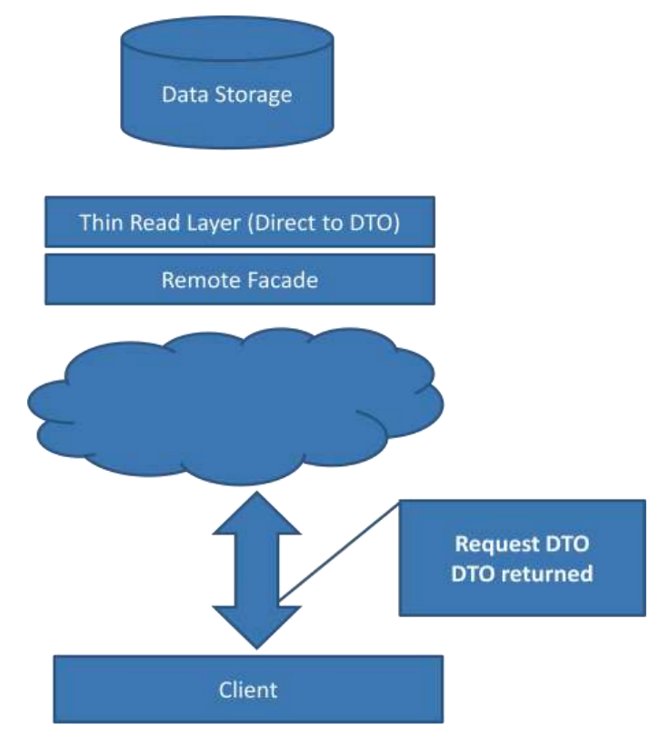
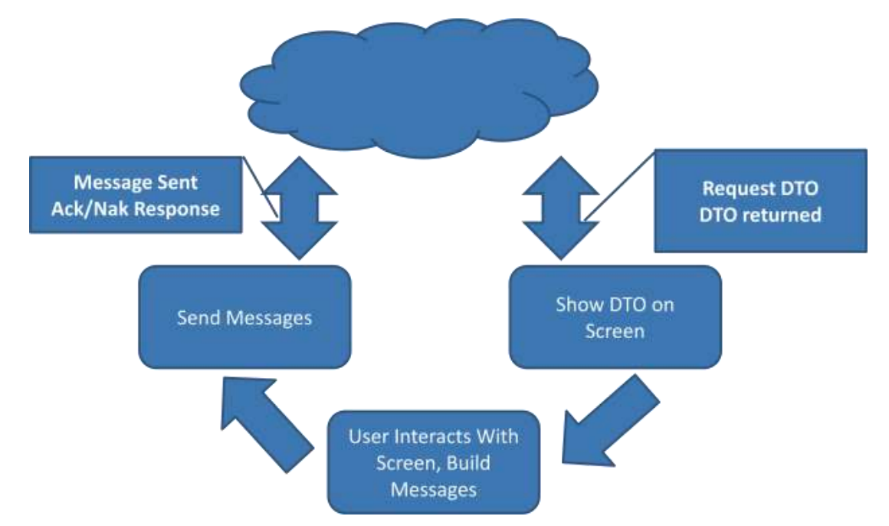

# CQS

> It states that every method should either be a command that performs an action, or a query that returns data to the caller, but not both. In other words, asking a question should not change the answer. More formally, methods should return a value only if they are referentially transparent and hence posses no side effects. (Bertrand Meyer)

- 메소드에 반환값이 있다면 상태를 바꾸지 말고, 상태를 바꾼다면 void로 반환해라
- 상태를 바꾼 뒤 바뀐 상태 값을 반환하는게 유용한 경우 예외가 있을 수 있음 (ex. stack.pop()) 
  - JPA IDENTITY 처럼 auto-generated 아이디 반환이 강제되는 경우도 있을테니, 결국 뭐가 됐든 쿼리 메소드에서 상태를 바꾸는 일만 안하면 되지 않을까?

> Meyer likes to use command-query separation absolutely, but there are exceptions. Popping a stack is a good example of a modifier that modifies state. Meyer correctly says that you can avoid having this method, but it is a useful idiom. So I prefer to follow this principle when I can, but I'm prepared to break it to get my pop. (Martin Fowler)

# CQRS 
**(Command and Query Responsibility Segregation)**
- 컨셉 자체는 CQS 와 동일하다.
- 차이는 CQRS에서는 Command, Query 객체가 나뉜다는 것

**(Before CQRS)**
```
CustomerService

void MakeCustomerPreferred(CustomerId)
Customer GetCustomer(CustomerId)
CustomerSet GetCustomersWithName(Name)
CustomerSet GetPreferredCustomers()
void ChangeCustomerLocale(CustomerId, NewLocale)
void CreateCustomer(Customer)
void EditCustomerDetails(CustomerDetails)
```

(after CQRS)
```
CustomerWriteService // Command side

void MakeCustomerPreferred(CustomerId)
void ChangeCustomerLocale(CustomerId, NewLocale)
void CreateCustomer(Customer)
void EditCustomerDetails(CustomerDetails)


CustomerReadService // Query side

Customer GetCustomer(CustomerId)
CustomerSet GetCustomersWithName(Name)
CustomerSet GetPreferredCustomers()
```

## Examples of Different Needs on the Different Side

### Consistency
- Command
  - transactional consistency로 해결 가능한 부분만 처리 (eventual consistency로 처리 가능한 부분과 분리)
- Query 
  - 쿼리 쪽은 거의 대부분이 eventually consistent 해도 상관없음

### Data Storage
- Command
  - relational structure with transaction
- Query
  - 조인을 최소화하기 위한 비정규화된 형태의 데이터

### Scalability
- Command
  - 전체 중 매우 작은 수의 트랜잭션을 일반적으로 처리
  - 그러므로, 확장성이 항상 중요하진 않다.
- Query
  - 전체 중 매우 많은 수의 트랜잭션을 일반적으로 처리하기 때문에 확장성은 쿼리 사이드에서 더 중요하다.

> It is not possible to create an optimal solution for searching, reporting, and proecssing transactions utilizing a single model.


## The Query Side

- Domain 객체를 바로 클라이언트에 내보내는 것 = a large source of the pain
  - 클라이언트에 보여주기 위한 DTO 와 도메인 모델은 다르다.
  - 전자는 Query 용, 후자는 Command 용
- 쿼리 모델에 대한 최적화는 쉽지 않다.
  - object model => data model 로 번역된 형태이기 때문에 특히, ORM 을 사용하는 경우 이러한 쿼리 모델을 최적화하기는 힘들다. (ORM과 DB 자체에 대한 지식이 깊어야 한다.) 



### Thin Read Layer

- DB로 부터 직접적으로 데이터를 읽어서 DTO projection
- vendor 에 직접적으로 결합되어 있어도 꼭 나쁜 것 만은 아니고, 필요하다면 stored procedure 등 사용하는 것도 ok
  - 팀 및 non-functional 요구사항에 맞춰 결정
- Read Layer를 분리했을 때의 장점?
  - 데이터 모델을 바로 사용하면 되기에 impedence mismatch 로 고통받을 필요가 없음 + 더 편한 최적화
  - query side 만 작업하는 경우 도메인 모델이나 ORM에 대한 지식이 없어도 상관없음


## The Command Side
- a simple object with a name of **an operation and the data** required to perform that operation.

### DTO up/down architecture 


- 장점
  - very simple and straight-forward
  - 서버에서 하는 일이라고는 받은 DTO를 저장소에 업데이트 하면 끝이기 때문.
- 단점
  - 사용자의 action 이 있은 후 변경된 DTO를 서버에 보내기 때문에, 서버에서 받는 것은 단순히 현재 상태를 담고 있는 DTO에 불과하다. 즉, 사용자의 진짜 의도가 무엇이었는지는 알 수가 없다.


### an interaction capturing intent



- 위 아키텍처와 유사하지만 여기서는 행위의 결과를 담은 DTO를 보내는 것이 아니라, 무엇을 하라는 의도 자체를 서버에 보낸다.
  - send a message to the server telling to do something.
  - ex. Complete a Sale, Approve a Purchase Order, Submit a Loan Application ...
- 클라이언트가 의도를 담은 action 을 보내면, 그에 대한 처리는 서버에서 행한다. 이게 바로 `Command`

### Command

```kotlin
class StartLoanEvaluationCommand(   // operation
    val 대출신청번호,
    val 대출심사에 필요한 유저 입력정보 ... // operation 에 필요한 데이터
)
```

- 받은 요청에 대해 거절할 수 있어야 command (거절할 수 없다면 event로 봐야한다.)
- Command 표현은 UseCase 에 초점을 맞추어야 한다.
  - 무엇이든 Command 형태로 표현은 가능하다. (ex. ChangeAddress, CreateUser, DeleteClass ...)
  - 다만, 비즈니스적인 인사이트를 위해 도메인, UseCase와 관련있는 용어를 써야한다.


### References
- https://cqrs.wordpress.com/wp-content/uploads/2010/11/cqrs_documents.pdf