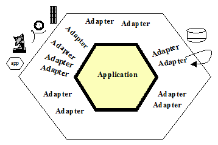
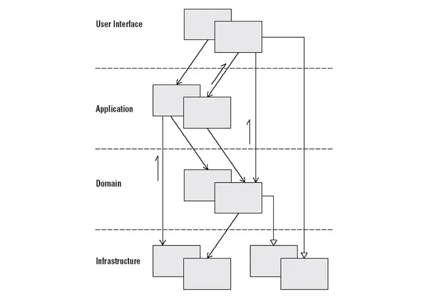
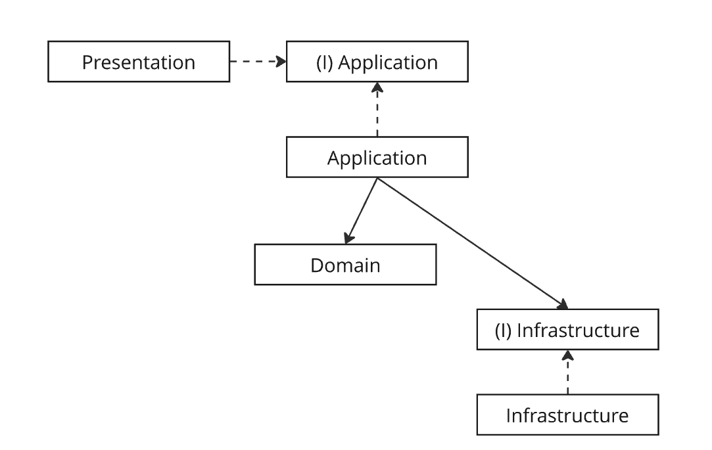
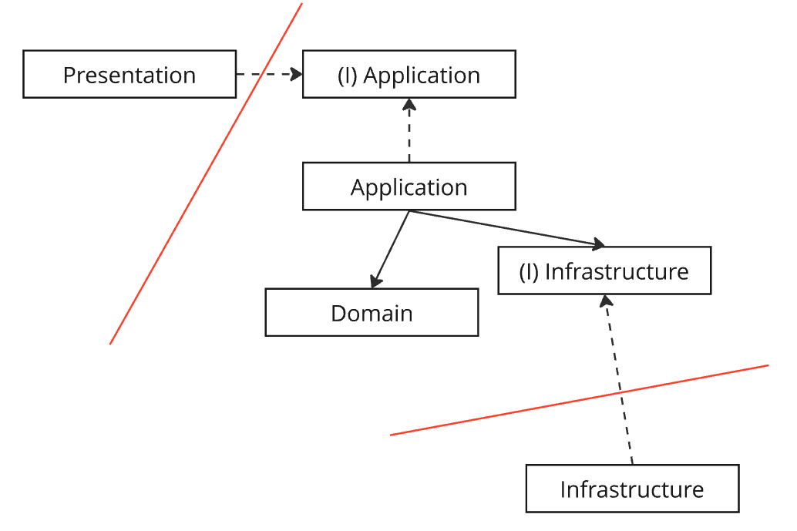

## Ports And Adapters

### 목적
- 기술적인 부분과 비즈니스 로직의 분리
> 1. The application is **blisfully ignorant of the nature of the input device.**
> 2. The application has a semantically sound interaction with the adapters on all sides of it, **without actually knowing the nature of the things on the other side of the adapters**.

### Idea
- 어댑터 <> 포트로 연결
- inbound
  - 어댑터를 통해 들어온 technology specific한 호출을 포트를 거쳐 어플리케이션 내부의 message/procedure call 로 변경
- outbound
  - 어플리케이션 내부의 메시지를 어댑터를 거쳐 받는 쪽에 맞는 언어로 번역 후 요청전송

### 장점
- 기술적 관심사 <> 비즈니스적 관심사의 완전한 격리
  - productivity
    - 인프라가 준비되지 않아도 개발 및 테스트가 가능하다.
  - testability
    - 복잡한 비즈니스 로직과 기술적인 부분이 섞이는 순간 의존성을 배제한 테스트가 쉽지 않다.
- OCP
  - ex. API 호출 --> MQ 메시지 컨슘으로 변경 시 어플리케이션 내부의 로직 변경없이 어댑터만 갈아끼면 된다.   
- interoperability
  - 로직이 동일하고 driven 하는 주체만 다른 경우도 쉽게 핸들링이 가능하다.

### 단점
- 코딩량...

### vs layered architecture

#### 문제점

Layered 아키텍처를 적용했을 때 언급되는 문제점으로는 다음과 같은 사항들이 있었다.

 

**promote database driven design**
- Eric Evans DDD 또한 Layered Architecture 를 예시로 들고 있는데...
- Domain 레이어부터 Bottom up으로 개발해나가면 되는거 아닌가?

**계층 간 경계이슈** 
> First and worst, people tend not to take the “lines” in the layered drawing seriously. They let the application logic leak across the layer boundaries, causing the problems mentioned above. 
  - 위 그림에 따른다면 Presentation Layer/Domain Layer --> Database 접근이 가능한데, 경험에 따르면 이 부분이 허용이 되는 순간 Repository가 여기저기 위치하는 문제가 있었다.
    - 특히 도메인 로직과 기술적 관심사가 섞이게 된다는 문제점이 가장 크다.
  - 다만, 이 부분은 컨벤션으로 정한다음 모듈로 강제가 가능

**Ridgidity**
> Secondly, there may be more than two ports to the application, so that the architecture does not fit into the one-dimensional layer drawing.
  - 변화가 쉽지 않다는게 단점이라는데...
  - 이것도 사이사이에 인터페이스를 잘 넣어주면 되는거 아닌가?

위 단점들을 해소하려고 강제하다보면 어느 순간 이런 그림이 되는데 ...

경계선을 그어보면,

어느 순간 헥사고날 아키텍쳐와 유사한 모양으로 변하긴 한다.

### 결론

- 아키텍처 또한 특정 구조를 강제함으로써 소프트웨어 개발의 복잡성을 다루는데 도움을 주는 수단으로 보여진다.
- 가장 치명적인 이슈라고 생각되는 기술적 관심사 <> 비즈니스 관심사가 섞일 수 있다는 부분을 해소하기 위해 layered architecture 에 강제성을 부여하다 보면 결국에는 hexagonal architecture 와 유사한 구조로 가게된다.
- 그렇다면 둘 중에 선택한다고 했을 때, 비즈니스가 복잡할수록 hexagonal architecture 쪽을 단순하다면 layered architecture 쪽을 고르면 되는게 아닐까?

## References
- https://web.archive.org/web/20170730135337/http://alistair.cockburn.us/Hexagonal+architecture
- https://www.linkedin.com/pulse/whats-wrong-layered-architecture-what-alternative-part-1-tiwari/
- https://happy-coding-day.tistory.com/entry/Layered-Architecture-%EC%9D%98-%EB%8B%A8%EC%A0%90%EC%9D%B4-%EB%AC%B4%EC%97%87%EC%9D%B4%EB%9D%BC%EA%B3%A0-%EC%83%9D%EA%B0%81%ED%95%98%EB%8A%94%EA%B0%80
- https://msolo021015.medium.com/layered-architecture-deep-dive-c0a5f5a9aa37