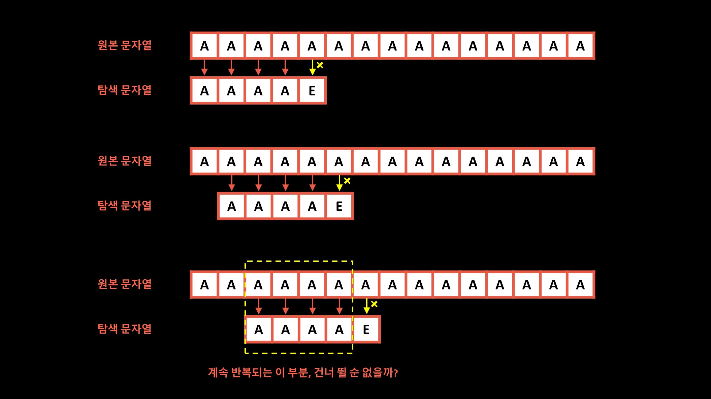

# 문자열 검색

---

N: 텍스트의 길이
M: 패턴의 길이

## 단순한 문자열 검색



- O(N * M)

## KMP 알고리즘

---

- 다음 문자부터 탐색하는 것이 아닌, 앞서 탐색했던 정보를 이용하여 몇 칸 더 건너띄는게 가능한가? 
  - 건너 띈 후의 부분이 동일하면 가능하다.
  - 그래야 그 이후로 탐색하는게 의미가 있기 때문


### 접두사와 접미사

ex. banana

**접두사 (prefix)**
```
b
ba
ban
bana
banan
banana
```

**접미사 (prefix)**
```
a
na
ana
nana
anana
banana
```

KMP 알고리즘에서 정의하는 접두사, 접미사?
- 문자열 맨 앞과 맨 뒤에서 같은 문자열이 나오는 경우


### pi 배열
- pi[i]: 주어진 문자열의 0 ~ i 까지의 부분 문자열 중, prefix == suffix 가 될 수 있는 부분 문자열 중에서 가장 긴 것의 길이'
- ex. 주어진 문자열: ABAABAB

| i | 부분 문자열  | pi[i] |
|---|---------|-------|
| 0 | A       | 0     |
| 1 | AB      | 0     |
| 2 | ABA     | 1     |
| 3 | ABAA    | 1     |
| 4 | ABAAB   | 2     |
| 5 | ABAABA  | 3     |
| 6 | ABAABAB | 2     |

### 구현

1. pi 배열을 구한다.
2. text <> pattern 의 각 문자를 검사하면서 일치하는지 확인한다.
   1. 일치하면 다음인덱스를 이어서 확인하고
   2. 불일치시 바로 전까지의 인덱스를 통해 pi 배열의 값을 얻어온다. 해당 pi 배열의 값을 인덱스로 하는 pattern 문자 위치를 방금 불일치한 문자 위치로 변경한 후 둘을 비교한다.
   3. 여기서 일치하면 1번 과정으로 돌아가고,
   4. 여기서 불일치하면 전체 한 칸 앞으로 이동 후 1번부터 다시 시작한다.


## AC (Aho-Corasick)

---

- 패턴 하나를 탐색하는 매칭 알고리즘은 KMP를 통해 선형시간에 해결가능
- 다만, 패턴 개수가 많아지면 그 개수에 비례해서 속도가 느려진다.
  - m = 모든 패턴들의 길이의 합
  - p = 패턴 수
  - n = text 의 크기
  - O(m + p * n)
- 아호 코라식 알고리즘을 이용하면 O(m + p + n)의 시간복잡도로 다양한 패턴집합에 대한 탐색도 선형시간에 해결이 가능하다. 이때, trie를 활용한다.
  - 패턴 문자열의 개수와 상관없이 원본 문자열을 한 번만 훑어서 매칭된 문자열을 찾아낸다.

### Failure Link

**설명** <br>
- KMP와 달리 검색어가 여러개이므로 걸칠 수 있는 대상은 하나가 아니라 여러 개가 될 수 있다.
- ~AB 까지 일치여부를 확인하고 실패했다면, AB로 시작하는 다른 지점으로 이동해서 그 다음부터 다시 일치/실패여부를 확인해 나간다.
- = 이전까지 일치한 부분 문자열의 접미사를 접두사로 가지는 다른 검색어로의 링크를 만들어 주는 것

**구현** <br>
다음 글자가 대응하는데 실패했을 때 다음으로 가서 시도해야 할 노드의 포인터 할당

1. Trie 루트로부터 BFS 를 수행하면서 Failure Link 만들기
2. 현재 위치(p)와 가리키는 노드(q)에 대해서
   1. p == root, failure(q) = root
   2. p != root, p의 실패링크에서 q와 같은 문자로 이어지는 노드(r)가 있는지 확인한다.
      1. 있다면 f(q) = r
      2. 없다면 p 에 f(p)를 대입한 뒤 i 부터 과정을 반복한다.


### Success Link (= output link)

**설명** <br>
- 현재 문자가 비교 중인 텍스트 원소와 일치한다면 이동할 노드 링크
  - 패턴들 중 다른 패턴의 substring인 string이 존재하게 되면 text에 등장하는 모든 패턴들을 탐색하지 못할 수 있다.
  - 이를 막기 위해 success link를 둔다.
- 처음에 각각의 패턴 string 들이 끝나는 정점은 그 정점을 success link로 가지게 된다.

**구현**
1. Failure Link 를 따라가서 패턴이 끝이 나게 되면 여러 단계의 Failure Link를 무시하고 바로 그 정점으로 Success Link 연결
2. 그렇지 않으면 그 정점의 Success Link 가져오기

### 탐색

**구현**
1. text 내 문자와 trie 에서 나가는 간선의 글자와 비교하면서 일치하면 해당 정점으로 이동한다.
2. success link가 존재하면 매칭 패턴이 존재한다는 의미이므로 결과에 추가한다.
3. trie 내 일치하는 문자가 없는 경우 일치하는 문자를 찾거나 root 에 도달할 때까지 failure_link 를 찾아간다.
4. 문자열을 모두 탐색할 때까지 1~3을 반복한다.

## References
### KMP Algorithm
- https://bowbowbow.tistory.com/6

### Aho-Corasick Algorithm
- https://www.slideshare.net/slideshow/ahocorasick-algorithm/53152784
- https://ansohxxn.github.io/algorithm/ahocorasick/#3%EF%B8%8F%E2%83%A3-%EA%B2%80%EC%83%89-%ED%95%A8%EC%88%98-kmp-%EC%95%8C%EA%B3%A0%EB%A6%AC%EC%A6%98-%EB%B0%A9%EC%8B%9D%EC%9C%BC%EB%A1%9C-%ED%8A%B8%EB%9D%BC%EC%9D%B4%EC%97%90%EC%84%9C-%EA%B2%80%EC%83%89