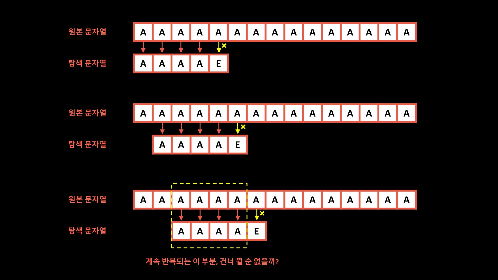

# 문자열 검색

---

N: 텍스트의 길이
M: 패턴의 길이

## 단순한 문자열 검색



- O(N * M)

## KMP 알고리즘

- 다음 문자부터 탐색하는 것이 아닌, 앞서 탐색했던 정보를 이용하여 몇 칸 더 건너띄는게 가능한가? 
  - 건너 띈 후의 부분이 동일하면 가능하다.
  - 그래야 그 이후로 탐색하는게 의미가 있기 때문


### 접두사와 접미사

ex. banana

**접두사 (prefix)**
```
b
ba
ban
bana
banan
banana
```

**접미사 (prefix)**
```
a
na
ana
nana
anana
banana
```

KMP 알고리즘에서 정의하는 접두사, 접미사?
- 문자열 맨 앞과 맨 뒤에서 같은 문자열이 나오는 경우


### pi 배열
- pi[i]: 주어진 문자열의 0 ~ i 까지의 부분 문자열 중, prefix == suffix 가 될 수 있는 부분 문자열 중에서 가장 긴 것의 길이'
- ex. 주어진 문자열: ABAABAB

| i | 부분 문자열  | pi[i] |
|---|---------|-------|
| 0 | A       | 0     |
| 1 | AB      | 0     |
| 2 | ABA     | 1     |
| 3 | ABAA    | 1     |
| 4 | ABAAB   | 2     |
| 5 | ABAABA  | 3     |
| 6 | ABAABAB | 2     |

### 구현

1. pi 배열을 구한다.
2. text <> pattern 의 각 문자를 검사하면서 일치하는지 확인한다.
   1. 일치하면 다음인덱스를 이어서 확인하고
   2. 불일치시 바로 전까지의 인덱스를 통해 pi 배열의 값을 얻어온다. 해당 pi 배열의 값을 인덱스로 하는 pattern 문자 위치를 방금 불일치한 문자 위치로 변경한 후 둘을 비교한다.
   3. 여기서 일치하면 1번 과정으로 돌아가고,
   4. 여기서 불일치하면 전체 한 칸 앞으로 이동 후 1번부터 다시 시작한다.


## References
### KMP Algorithm
- https://bowbowbow.tistory.com/6
