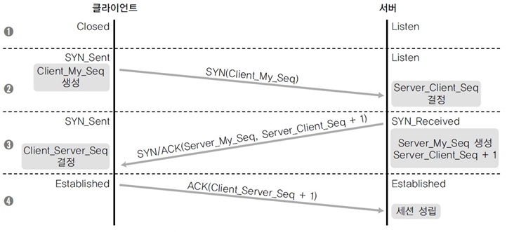
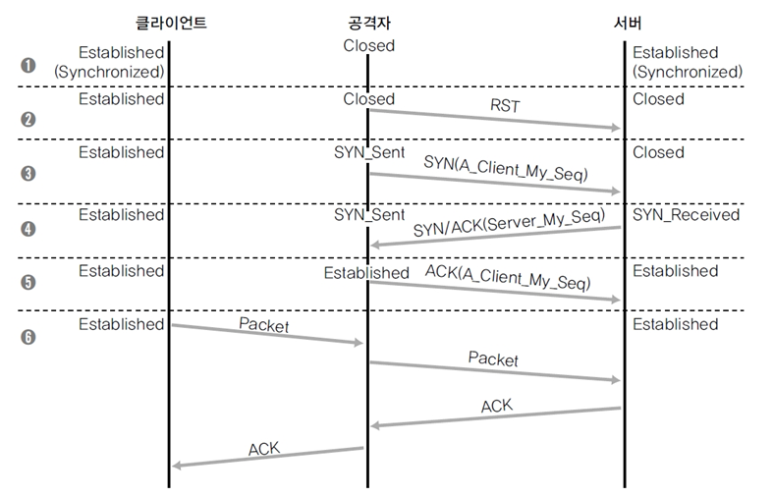
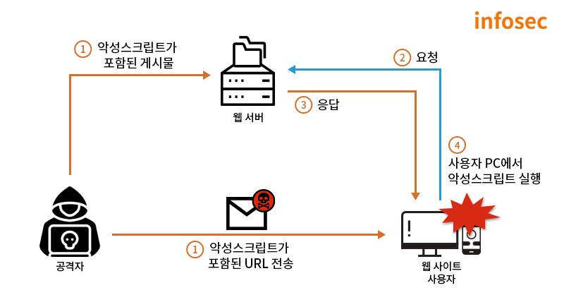
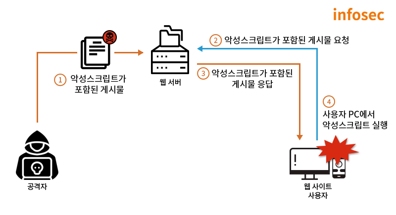
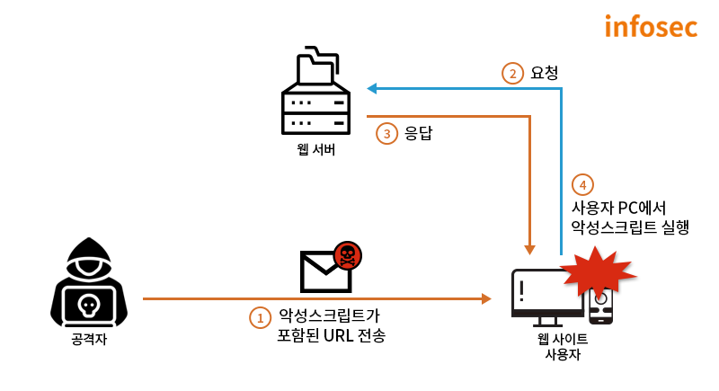
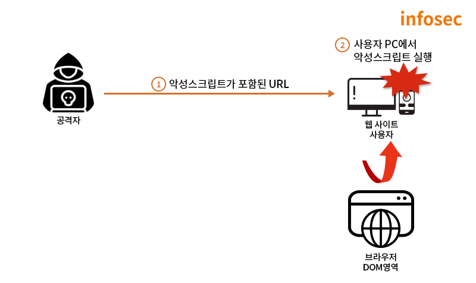
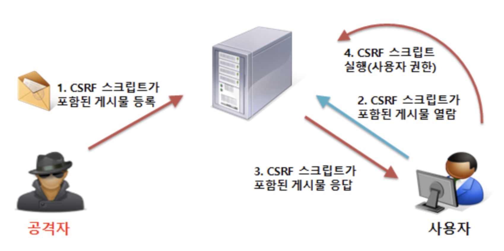
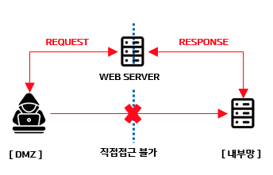

## 쿠키 (Cookie)

### What is Cookie?

- 서버에서 유저의 브라우저에 보내는 작은 데이터 조각
  - a small piece of data a server sends to a user's web browser.
- 브라우저에서 보관, 생성, 수정 등 또한 가능

### Cookie 용도

- 해당 요청이 동일한 브라우저, 유저에게서 온 것인가? (= session management)
  - 즉, Http 의 basic nature 는 stateless지만 쿠키를 활용해 제한된 state 저장도 가능하다. 
  - 로그인 한 유저의 sessionId를 쿠키에 담아 클라이언트에게 전달하고, 이 정보를 통해 해당 유저가 인증이 된 유저인지 확인 후 그에 맞는 정보를 보여준다.
- Personalization
  - UI theme, 언어 등 사용자의 선호도를 저장한 후 활용가능하다.
- Tracking
  - 사용자의 행동을 recoding 한 후 analyzing 하는데 활용한다.
- 등등... 
  - 과거에는 client-side 데이터를 저장하는 용도로도 활용되었으나 이제는 크게 추천하지 않는다.
    - 보안이슈.
    - 브라우저마다 차이가 있지만 사용가능한 개수, 용량에도 한계가 있음.

### Cookies & Security Violations

**Session hijacking**
- Session
  - point < > point 간 연결이 활성화 된 상태
- 세션 하이재킹은 시스템 간 연결이 된 상태, 즉 로그인 상태를 가로채는 것을 말한다.
- 서버 < > 클라이언트에 잘못된 시퀀스 넘버를 위조해서 연결된 세션에 잠시 혼란을 준 뒤 끼어드는 방식 

(정상적으로 세션을 맺는 경우 handshaking)

(비정상적으로 세션을 맺는 경우 handshaking)
1. 공격자가 적절한 시퀀스 넘버를 획득하기 위해 sniffing 
2. 공격시점에 비동기화 상태 중 세션이 완전히 끊어지지 않는 시퀀스 넘버의 범위에서 RST 패킷을 생성하여 보냄 
   1. 서버는 잠시 Closed 상태로 변경됨
3. 공격자가 새로운 client 시퀀스 넘버를 생성하여 서버에 보내고, 서버에서 해당 번호를 accept
4. 서버에서 다시 시퀀스 넘버 생성해서 공격자에게 전송
5. 공격자 < > 서버 간 세션 Established

- 요즘 대부분의 사이트는 Https 로 통신을 하기 때문에 많이 발생하지는 않는 문제
  - SessionId 를 중간에 가로채는 것이 문제인데, 암호화를 통한 Session Id 전달이 이루어지므로
- Ack-Storm
  - 클라이언트 < > 서버 간 시퀀스 넘버 불일치로 인해 조정작업이 무한 반복되는 도중에 ACK 패킷이 계속 날아가게 되는 것 

**XSS(Cross-Site Scripting) Attack**

- 공격자가 게시물 또는 URL 을 통해 삽입한 악성스크립트가 사용자의 요청에 의해 사용자 측에서 응답함으로써 발생
- 사용자의 입력값을 받는 모든 곳에서 발생가능하며, 웹 서버 사용자에게 직접적인 영향을 미칠 수 있는 공격기법이다.
  - 사용자 쿠키 값 탈취를 통한 권한도용, 세션토큰 탈취
  - keylogger 스크립트를 삽입하여 키보드 값 탈취
  - 피싱 사이트와 같은 악성사이트로의 접근유도
  - ...
- 게시물 또는 URL에 포함도니 악성스크립트가 동작하여 발생하는 취약점이므로 불특정 다수를 대상으로 공격시도가 가능하다.

공격 유형에 따라 아래 세 가지로 분류할 수 있다.

1. Stored XSS
   1. 저장형 크로스사이트 스크립팅 
      1. 공격자의 악성스크립트가 DB에 저장되고, 이 값을 출력하는 페이지에서 피해가 발생하는 취약점
   2. 악성 스크립트가 포함된 게시물을 작성하여 게시판 등 사용자가 접근할 수 있는 페이지에 업로드
   3. 사용자가 악성스크립트가 포함된 게시물을 요청하면, 공격자가 삽입한 악성스크립트가 사용자 측에서 동작

2. Reflected XSS 
   1. 반사형 크로스사이트 스크립팅
   2. 사용자가 요청한 악성스크립트가 사용자 측에서 반사되어 동작하는 취약점
      1. 공격자의 악성스크립트가 데이터베이스와 같은 저장소에 별도로 저장되는 것이 아니라 사용자의 화면에 즉시 출력되면서 피해가 발생
   3. 악성스크립트가 삽입된 URL을 클릭하거나 공격자에 의해 악의적으로 조작된 게시물을 클릭했을 때, 사용자의 브라우저에서 악성스크립트 실행

3. DOM Based XSS
   1. 악성스크립트가 DOM 영역에서 실행 (서버와의 상호작용없이 브라우저 자체실행)

방지대책?
- 입력값 검증을 통한 악성스크립트 삽입방지
- 악성스크립트가 입력되어도 동작하지 않도록 출력값 무효화
  - 스크립트에 쓰이는 문자가 입력될 경우 일반문자로 치환 등

**CSRF (Cross-site Request Forgery)**
- 사용자가 자신의 의지와는 무관하게 공격자가 의도한 행위(수정, 삭제, 등록 등)를 특정 웹사이트에 요청하게 하는 공격

CSRF 성공을 위한 전제조건
1. 사용자가 보안이 취약한 서버에 로그인되어 있어야 함
2. 쿠키 기반의 서버세션 정보를 획득할 수 있어야 함
   1. 다시 말하면, 인증에 쿠키를 사용하지 않을 경우 CSRF 공격은 걱정하지 않아도 된다.
   2. https://security.stackexchange.com/a/166798
3. 공격자는 서버를 공격하기 위한 요청방법에 대해 미리 파악하고 있어야 함.

ex. 악성 스크립트가 작성된 페이지에 접근하면 위조된 요청 + 획득한 sessionId로 서버에 공격전송

(방지대책)

1. CSRF 토큰발급
- 서버에서 각 클라이언트에게 토큰을 발급한 후 해당 토큰은 세션에 보관함
- 클라이언트는 요청시마다 헤더에 토큰을 전달해야 하고, 서버에서는 클라이언트 토큰 값을 검증함

2. Referer 체크
- 일반적인 요청이라면 Host + Referrer 값이 같음
  - CSRF 공격의 대부분은 Referrer 값에 대한 검증을 통해 방어가능하다고 하다.

3. Captcha 등 추가 인증수단 도입
- ex. Captcha 인증코드가 없거나 틀리면 요청거부

4. SameSite
- https://portswigger.net/web-security/csrf/bypassing-samesite-restrictions

**SSRF(Server-side Request Forgery)**

* 서버 측에서 위조된 HTTP 요청을 발생시켜 직접적인 접근이 제한된 서버 내부 자원에 접근, 외부로 데이터 유출 및 오동작을 유발하는 공격
* HTTP 요청을 이용한 공격이기 때문에 형태만 보면 CSRF와 유사하다고 할 수 있으나, 공격자의 공격이 발현되는 지점이 서버측이므로 구분해서 SSRF라고 부른다.
* 접근이 제한된 내부환경에 추가공격이 가능하기 때문에 공격의 영향도가 더 높다.

SSRF 성공을 위한 전제조건
1. DMZ 역할을 수행하는 외부 웹 서버, 공격자 PC와 통신이 되지 않는 타깃의 내부 망 서버가 존재
2. 사용자가 전달한 URL 데이터를 가공하여 이미지 등을 제공하는 기능에 SSRF 취약점이 존재

(공격방법)
* 외부에서 접근가능한 웹서버의 File Inclusion 취약 파라미터를 통해 내부서버에 요청을 보내고 결과를 받아 정보를 탈취 및 오동작 유발

(공격 시나리오)

1. 포트스캔 및 내부 시스템파일 탈취
- 내부서버 포트 스캐닝을 통한 서비스 구동여부 확인 및 내부파일 접근
  - SSH 서버 포트 스캐닝 시 `file?=http://10.10.10.10:22`와 같은 공격구문 사용
- Linux/Unix 환경에서 /etc/passwd 파일 접근 시 `file?=file:///etc/passwd`와 같은 공격구문 사용
- `sftp://evil.com:11111/`, `ldap://localhost:11211/%Oastats%Oaquit`, `gopher://127.0.0.1:25/xHELO` 등 서버가 허용하는 URL 스키마에 따라 추가접근 가능
2. ProxyLogon 기반 (CVE-2021-26855) 
- MS Exchange Server SSRF 를 통한 내부 교두보 확보
- X-BEResource 쿠키 변조를 통해 내부 서버 리소스 접근가능
- `/ecp/proxyLogon.ecp` 파일을 호출하여 강제로 세션 연결이 가능한 ProxyLogon을 이용해 별도의 인증없이 공격자와 Exchange Server 간 HTTP 연결 수행
3. AWS 클라우드 기반
- SSRF 취약점이 존재하는 IMDSv1 AWS 클라우드 환경에서 카드 이미지 업로드 시에 사용되는 매개변수 url에 S3 버킷 데이터 노출 (취약 파라미터)
- 취약 파라미터 url에  `http://169.254.168.254/latest/meta-data/iam/security-credentials/ISRM-WAF-ROLE` 공격구문을 사용하여 AWS MetaData 및 ISRM-WAF-ROLE 의 AccessKey 및 Token 탈취
- 탈취한 AccessKey 및 Token은 ISRM-WAF-ROLE 권한 획득에 활용되어 공격자의 AWS 접근 및 서버 내 S3버킷 데이터 탈취에 악용

(방지대책)

1. 네트워크 기반의 SSRF 대응
- 중요한 데이터는 DMZ 망의 웹 서버와 연결되지 않은 고립된 내부서버에 저장
- URL 스키마 방식을 http, https만 허용
- Snort와 같은 침입 모니터링 시스템 배치. SSRF 탐지 정책을 반영하여 웹 서버 < > 내부 서버 사이의 트래픽 탐지

2. 애플리케이션 기반의 SSRF 대응
- 사용자 입력을 받는 기능에 대한 시큐어 코딩
  - ex. 사용자 입력값이 화이트리스트에 등록된 주소와 연관되지 않은 경우 모두 차단

### 보안 관련해서 알아둘 Cookie Options

Secured

HttpOnly

## References
- https://developer.mozilla.org/en-US/docs/Web/HTTP/Cookies
- https://blog.naver.com/wnrjsxo/221114275533
- https://tlatmsrud.tistory.com/77
- https://gisungcu.tistory.com/415
- https://www.igloo.co.kr/security-information/ssrf-%EC%B7%A8%EC%95%BD%EC%A0%90%EC%9D%84-%EC%9D%B4%EC%9A%A9%ED%95%9C-%EA%B3%B5%EA%B2%A9%EC%82%AC%EB%A1%80-%EB%B6%84%EC%84%9D-%EB%B0%8F-%EB%8C%80%EC%9D%91%EB%B0%A9%EC%95%88/
- https://velog.io/@r99bbit/Server-Side-Request-Forgery-SSRF