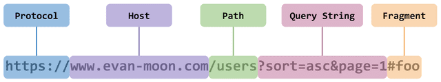
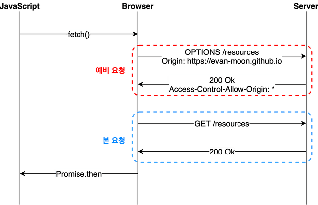
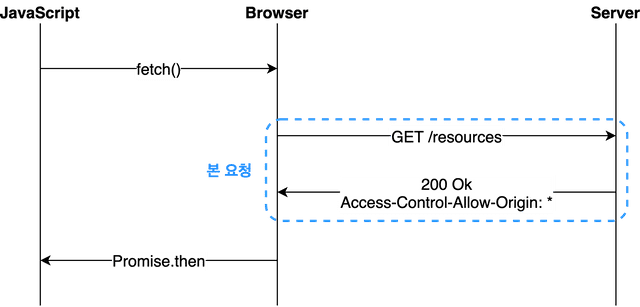

# CORS (Cross-Origin Resource Sharing) 살펴보기

## 출처(Origin)

- 출처란 Protocol, Host 그리고 Port 를 합친 것

## SOP(Same-Origin Policy)

- 같은 출처에서만 리소스를 공유할 수 있도록 하는 정책
- 웹 환경의 특성상 무작정 SOP로 설정하기 힘든 감이 있다.
  - 다른 출처에서 리소스를 가져와서 사용하는 경우가 매우 흔하므로
- 그래서 몇 가지 예외 조항을 두었는데, 이것이 바로 CORS 정책을 지킨 리소스 요청

## CORS

- CORS 자체는 브라우저에 구현된 스펙에 포함되는 정책
  - 서버 < > 서버 통신 시 적용X
  - 브라우저 < > 서버 간 통신시에도 보통 서버는 응답을 하고 브라우저 상에서 CORS 위반이라면서 응답을 버린다. 

### CORS 동작 살펴보기

**기본**
- 브라우저가 요청 헤더에 출처(= Origin: ...) 담아서 전달  
- 서버가 요청에 대한 응답 생성 시 `Access-Control-Allow-Origin` 값으로 접근이 가능한 출처를 내려줌
- 브라우저가 받아서 자신의 Origin vs Access-Control-Allow-Origin 비교
- 유효한 응답인지 결정

는... 아래 세 가지 시나리오에 따라 동작방식이 변경될 수 있다.

 

**1. Preflight Request**

(브라우저가 요청을 예비요청 - 본요청 순으로 나누어 보내는 경우)
- 예비요청을 Preflight 라고 부르며, HTTP 메소드 중 OPTIONS 메소드를 사용한다.
  - 본 요청을 보내기 전 브라우저 스스로 요청이 안전한지 확인하는 것
- 참고
  - 중요한 것은 예비요청의 성공, 실패여부가 아니라 응답 헤더에 유효한 `Access-Control-Allow-Origin` 값이 들어있는 것
  - 즉, 예비요청이 실패하더라도 헤더에 위 값이 제대로 들어있다면 CORS 위반이 아님

 

**2. Simple Request**
- 예비요청 없이 본 요청부터 전송. 이후 응답 헤더를 통해 CORS 정책위반여부 검사
  - 즉, 예비요청이 없다는 것만 preflight 와의 차이
- 아무 때나 사용하는 것이 아니라, 특정 조건을 만족하는 경우에만 예비요청 생략가능
  - 일반적인 아키텍처 사용시에 거의 충족시키기 어려운 조건임

 

**3. Credentialed Request**
- 인증된 요청을 사용하는 방법
  - CORS의 기본적인 방식이라기 보다는 다른 출처 간 통신에서 좀 더 보안을 강화하고 싶을 때 사용하는 방법
- `credentials`
  - XMLHttpRequest, fetch 등은 기본적으로 별도의 옵션 없이 브라우저의 쿠키정보나 인증과 관련된 헤더를 함부로 요청에 담지 않음
  - `credentials` 가 바로 그옵션
- option 에 사용되는 값 
  - same-origin: 같은 출처 간 요청에만 인증정보를 담을 수 있다.
  - include: 모든 요청에 인증정보를 담을 수 있다.
  - omit: 모든 요청에 인증정보를 담지 않는다.

=> 브라우저가 다른 출처의 리소스를 요청할 때 좀 더 빡빡한 검사조건을 갖는 것

=> Access-Control-Allow-Origin: * 불가 + Access-Control-Allow-Credentials: true 필요

## 참고자료
- https://evan-moon.github.io/2020/05/21/about-cors/