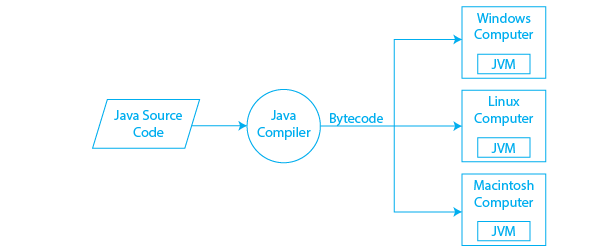
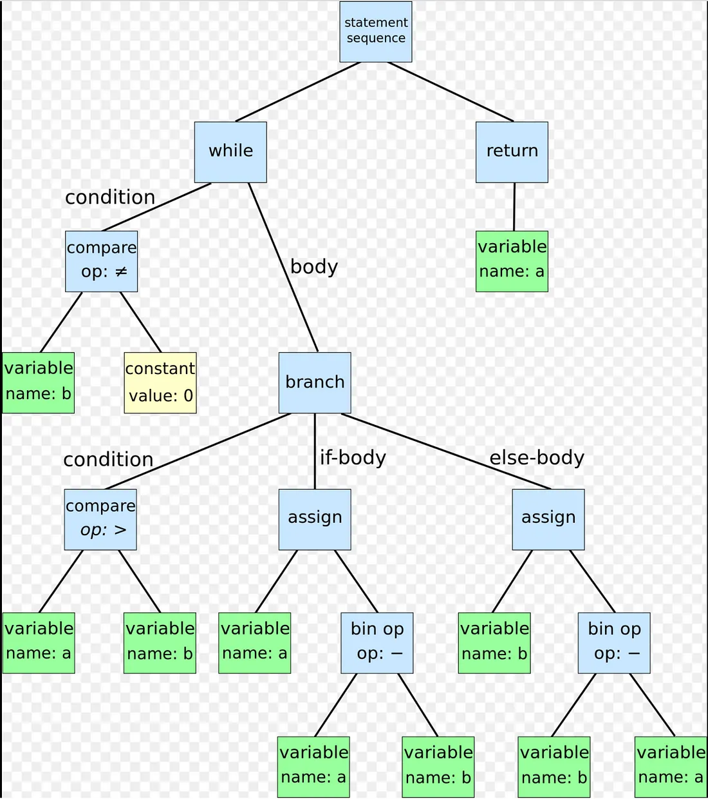

## Java Compiler
- .java to .class
- .class
  - machine-independent 한 바이트코드를 포함하는 파일
  - JVM 덕에 컴파일 된 .class 파일은 플랫폼에 상관없이 실행이 가능하다.
    - JVM이 바이트코드를 해당 플랫폼에 맞는 기계어 코드로 변환해준다.
    - 반대로 JVM 자체는 Platform Specific 하다. 



### 컴파일 과정 살펴보기

#### Parse
- 소스파일을 token 형태로 읽은 후 AST(Abstract Syntax Tree) 형태로 변환한다.
- token (by lexical analysis)
  - 코드의 문자를 읽어 정해진 규칙에 따라 이들을 토큰으로 만들어 합친다. 이 과정에서 공백, 주석, 괄호, 세미콜론 등은 삭제하고 마지막으로는 전체 코드를 토큰들로 나눈다.
    - Lexical Analyzer는 소스 코드를 글자 단위로 읽으며, 공백/연산자 기호/특수 기호 등을 만나면 해당 단어가 끝났다고 인지하고 하나의 토큰으로 만든다. 
    - ==, <=, while ... 이것들이 하나의 토큰이다.
  - ex. let x = 3
    - let indent x eq int 3 ...
- AST (by syntax analysis)
  - 소스코드의 abstract syntactic structure를 표현하는 트리구조
    - 구조적, 언어적으로 문제가 있으면 에러를 내뱉는다.
  - 트리의 각 노드는 소스코드의 구성요소를 나타내며, 프로그램에 대해 유용한 추가정보를 가지고 있다. (ex. position: 소스 코드에서 각 요소가 어디쯤 위치해 있는지)
  - meaning of `abstract`
    - 완전히 세부적인 사항은 포함하지 않고 구조적인 혹은 내용과 관련된 사항들만 포함하기 때문 
```java
CompilationUnit
 └── TypeDeclaration (class: HelloWorld)
     └── MethodDeclaration (public static void main(String[] args))
         └── Statement (System.out.println("Hello, World!"))
```


<details>
  <summary>AST in javascript</summary>
  
  ```javascript
  // source code
  function square(n) {
    return n * n
  }
  ```

  ```JSON
  {
  "type": "Program",
  "start": 0,
  "end": 36,
  "loc": {
    "start": {
      "line": 1,
      "column": 0
    },
    "end": {
      "line": 3,
      "column": 1
    }
  },
  "range": [0, 36],
  "errors": [],
  "comments": [],
  "sourceType": "module",
  "body": [
    {
      "type": "FunctionDeclaration",
      "start": 0,
      "end": 36,
      "loc": {
        "start": {
          "line": 1,
          "column": 0
        },
        "end": {
          "line": 3,
          "column": 1
        }
      },
      "range": [0, 36],
      "id": {
        "type": "Identifier",
        "start": 9,
        "end": 15,
        "loc": {
          "start": {
            "line": 1,
            "column": 9
          },
          "end": {
            "line": 1,
            "column": 15
          },
          "identifierName": "square"
        },
        "range": [9, 15],
        "name": "square",
        "_babelType": "Identifier"
      },
      "generator": false,
      "async": false,
      "expression": false,
      "params": [
        {
          "type": "Identifier",
          "start": 16,
          "end": 17,
          "loc": {
            "start": {
              "line": 1,
              "column": 16
            },
            "end": {
              "line": 1,
              "column": 17
            },
            "identifierName": "n"
          },
          "range": [16, 17],
          "name": "n",
          "_babelType": "Identifier"
        }
      ],
      "body": {
        "type": "BlockStatement",
        "start": 18,
        "end": 36,
        "loc": {
          "start": {
            "line": 1,
            "column": 18
          },
          "end": {
            "line": 3,
            "column": 1
          }
        },
        "range": [18, 36],
        "body": [
          {
            "type": "ReturnStatement",
            "start": 22,
            "end": 34,
            "loc": {
              "start": {
                "line": 2,
                "column": 2
              },
              "end": {
                "line": 2,
                "column": 14
              }
            },
            "range": [22, 34],
            "argument": {
              "type": "BinaryExpression",
              "start": 29,
              "end": 34,
              "loc": {
                "start": {
                  "line": 2,
                  "column": 9
                },
                "end": {
                  "line": 2,
                  "column": 14
                }
              },
              "range": [29, 34],
              "left": {
                "type": "Identifier",
                "start": 29,
                "end": 30,
                "loc": {
                  "start": {
                    "line": 2,
                    "column": 9
                  },
                  "end": {
                    "line": 2,
                    "column": 10
                  },
                  "identifierName": "n"
                },
                "range": [29, 30],
                "name": "n",
                "_babelType": "Identifier"
              },
              "operator": "*",
              "right": {
                "type": "Identifier",
                "start": 33,
                "end": 34,
                "loc": {
                  "start": {
                    "line": 2,
                    "column": 13
                  },
                  "end": {
                    "line": 2,
                    "column": 14
                  },
                  "identifierName": "n"
                },
                "range": [33, 34],
                "name": "n",
                "_babelType": "Identifier"
              },
              "_babelType": "BinaryExpression"
            },
            "_babelType": "ReturnStatement"
          }
        ],
        "_babelType": "BlockStatement"
      },
      "_babelType": "FunctionDeclaration"
    }
  ]
}
  ```

</details>

#### Enter
- 심볼 테이블에 정의를 위한 심볼을 입력한다.
- Symbol Table
  - 컴파일러에 사용되는 자료구조
  - 심볼 테이블은 변수명, 함수명, 객체, 클래스, 인터페이스 등에 대한 정보를 가진다.
  - 심볼 테이블은 다음의 역할을 한다.
    - 구조화 된 형태로 모든 엔티티의 이름들을 한 곳에 저장한다.
    - 어떤 변수가 선언되었는지 확인한다.
    - 이름의 스코프를 결정한다.
    - 변수 및 표현식 검증 등을 통해 소스코드가 문법적으로 옳은지를 확인한다. (type checking)


#### Process Annotations
- 필요한 특정 어노테이션들은 프로세싱한다.

#### Attribute
- syntax tree를 구성한다. 
  - name resolution, constant folding, type checking 등을 포함한다.

#### Flow
- 트리(AST)를 가지고 dataflow 분석을 수행한다.
  - 할당 및 reachability 체크를 포함한다.

#### Desugar
- AST를 다시 rewrite 한다. (syntactic sugar 번역도 함께 이루어진다.)

#### Generate
- .class 파일을 생성한다. (= jvm bytecode)


## References
### Compiler
- https://www.scaler.com/topics/java-source-code-is-compiled-into/
- https://www.prepbytes.com/blog/java/java-compilation-process/
- https://medium.com/swlh/internals-of-compiler-and-jvm-f4d4dfd7092b
- https://github.com/jamiebuilds/the-super-tiny-compiler

### AST
- https://jake-seo-dev.tistory.com/124
- https://yceffort.kr/2021/05/ast-for-javascript