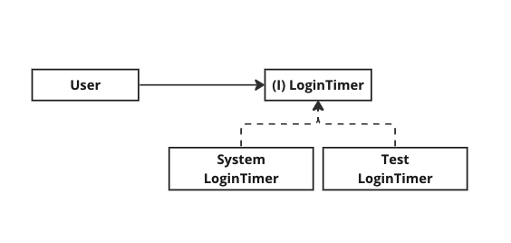

# 테스트하기 힘든 의존성

---

테스트 코드가 주는 장점은 여러가지가 있지만 그 중 하나는 코드를 작성하는 개발자에게 잘못된 설계에 대한 신호를 보내준다는 것이다. 어떤 코드를 테스트하기가 힘들다면 그건 설계에 문제가 있다는 이야기 일 수 있으므로 이에 대한 검토가 필요하다.

이곳에는 특히 테스트를 하기 힘들게 만드는 특정 케이스들은 어떤 것들이 있고, 여기에 대한 해결책은 무엇이 있는지 하나씩 정리해보려고 한다. 


## Case 1. 시스템 시간을 내부에서 생성

```kotlin
// source
class User {
    var lastLoginTime: LocalDateTime? = null

    fun login() {
        this.lastLoginTime = LocalDateTime.now()
    }
}
```

유저가 마지막으로 로그인 한 시간을 테스트한다면 다음과 같은 테스트코드가 필요하다.

```kotlin
@Test
fun `사용자가 로그인하면 마지막으로 로그인 한 시간이 해당시점으로 업데이트 된다`() {
    // given
    // 1. 사용자를 회원가입 시킨다.
    // 2. 해당 사용자를 불러온다.
    val user = userRepository.find(id, password)

    // when
    user.login()

    // then
    user.lastLoginTime shouldBe ...
}
```

마지막으로 로그인한 시간은 `login` 메소드 내부에서 `LocalDateTime.now()` 를 통해 할당

- 이때, 동일하게 `LocalDateTime.now()` 를 통해 값을 마지막으로 로그인 한 시간을 검증한다면 이 테스트코드는 `non-deterministic` 한 테스트로 바뀌게 된다.
  
  - 약간의 타이밍이라도 어긋나면 두 `LocalDateTime.now()` 값이 달라져버리기 때문이다.

- non-deterministic 한 단위 테스트는 양치기소년과 같다. 간헐적인 실패는 해당 원인을 분석하기보다 단순히 테스트를 재실행하게 만든다.
  
  - 하지만, 정말로 심각한 문제가 발생하고 있는 경우라면...
  
  - deterministic 한 테스트로 고쳐줘야한다. 어떻게?


### 해결책 1. 파라미터로 의존성 주입받기

테스트를 어렵게 만드는 부분은 `login` 메소드 내에서 직접 현재시간을 생성하고 있다는 점이다.

아래처럼 파라미터로 생성된 시간을 넘겨받으면 테스트 코드 상에서도 동일한 시간을 가질 수 있게 된다.

**(수정된 소스코드)**

```kotlin
class User {
    var lastLoginTime: LocalDateTime? = null

    fun login() {
        this.lastLoginTime = LocalDateTime.now()
    }
}
```


**(수정된 테스트코드)**

```kotlin
@Test
fun `사용자가 로그인하면 마지막으로 로그인 한 시간이 해당시점으로 업데이트 된다`() {
    // given
    // 1. 사용자를 회원가입 시킨다.
    // 2. 해당 사용자를 불러온다.
    val user = userRepository.find(id, password)
    val loginTime = LocalDateTime.now()

    // when
    user.login(loginTime)

    // then
    user.lastLoginTime shouldBe loginTime
}
```


#### **이렇게 문제가 해결되었을까?**

- 아니다.
  
  - 어디에서는 꼭 현재 시간을 생성해 줄 필요가 있다.   

- 서버 내에서 생성해주지 않는다면 클라이언트 쪽에서 전달 받아야 하는데, 이때 발생하는 문제는 layer간 파라미터 침투가 일어난다는 것이다.
  
  - **<u>테스트를 위해 최상단 레이어까지 파라미터를 침투시키는게 올바른 방향일까?</u>**
  
  - 결국 해당 레이어를 테스트할 때 이 부분에 대한 문제가 다시 발생할 수 있다. 그렇다면, 문제를 정말로 해결한 것이 아니라 **<u>문제를 다른 계층에 떠넘겨 버린게 아닐까?</u>**

```kotlin
// controller layer
// 파라미터가 서비스 레이어 인터페이스까지 침투했기 때문에 로그인을 위해서는 
// 컨트롤러 레이어도 시간을 알아야 한다.
userService.login(lastLoginTime) 

// service layer
user.login(lastLoginTime)
```


### 해결책 2. 의존성 역전 활용하기

**(수정된 소스코드)**

```kotlin
class User {
    var lastLoginTime: LocalDateTime? = null

    fun login(loginTimer: LoginTimer) {
        this.lastLoginTime = LocalDateTime.now()
    }
}
```

```kotlin
class UserLoginUseCase(
    private val userRepository: UserRepository,
    private val loginTimer: LoginTimer
) {
    fun login(command: UserLoginUseCase.Command) {
        val user = userRepository.find(command.id, command.password)
        user.login(loginTimer)
    }
}
```


(**의존성 역전이 적용된 LoginTimer**)



```kotlin
interface LoginTimer {
    fun generate(): LocalDateTime
}


class SystemLoginTimer : LoginTimer {    
    override fun generate(): LocalDateTime {
        return LocalDateTime.now()
    }
}

class TestLoginTimer : LoginTimer {    
    override fun generate(): LocalDateTime {
        return LocalDateTime.of(...) // hardcode current time
    }
}
```


**(수정된 테스트 코드)**

```kotlin
@Test
fun `사용자가 로그인하면 마지막으로 로그인 한 시간이 해당시점으로 업데이트 된다`() {
    // given
    // 1. 사용자를 회원가입 시킨다.
    // 2. 해당 사용자를 불러온다.
    val user = userRepository.find(id, password)
    val loginTimer = TestLoginTimer()

    // when
    user.login(loginTimer)

    // then
    user.lastLoginTime shouldBe <hardcoded time>
}
```

- 테스트 코드 상에서는 TestLoginTimer 를 주입함으로써 non-deterministic 한 테스트가 발생하는 문제를 해결한다.

(여기서 더 나아가 timer 내부에 timeGenerator를 프로퍼티로 두고 이 generator가 고정해서 시간을 생성하도록 만드는게 더 낫겠다.)
